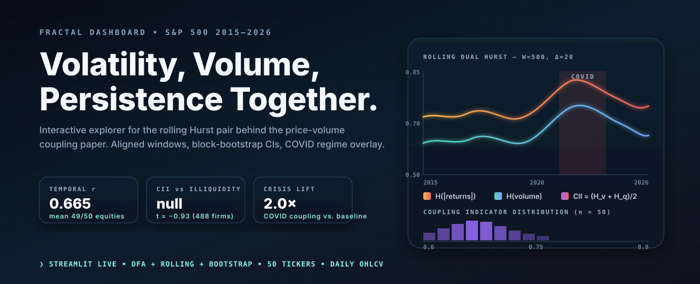

<p align="center">
  
</p>

<h1 align="center">Fractal Price-Volume Dashboard</h1>

<p align="center">
  <strong>Interactive explorer for the rolling Hurst pair behind the price-volume coupling paper.</strong>
</p>

<p align="center">
  <a href="https://fractal-pv.streamlit.app"></a>
  <a href="https://doi.org/10.5281/zenodo.19611544"></a>
  <a href="https://github.com/mhdk1602/fractal-pv-coupling"></a>
  
  
</p>

<p align="center">
  <a href="#what-the-dashboard-shows">What it shows</a> /
  <a href="#run-it-locally">Run locally</a> /
  <a href="#methods">Methods</a> /
  <a href="#headline-results">Headline results</a> /
  <a href="#citation">Citation</a>
</p>

## What the dashboard shows

Price volatility and trading volume both have long-range memory (Hurst exponent `H > 0.5`). This dashboard lets you walk through how the two persistence structures co-move through time for each of 50 S&P 500 equities, and what that co-movement does (and does not) say about future liquidity.

Three lenses, all interactive:

| Lens | What you do | What you see |
|---|---|---|
| **Time series view** | Pick a ticker. Toggle returns, |returns|, volume. | Aligned rolling DFA, dual-Hurst overlay, regime shading for COVID and 2018Q4. |
| **Coupling view** | Filter by sector or VIX regime. | Cross-sectional histogram of CII; per-ticker `r(H_v, H_q)` strip plot. |
| **Predictive view** | Choose the outcome: Amihud illiquidity, realized vol, abnormal volume. | Forward-window regression coefficients with block-bootstrap CIs. |

## Headline results

The dashboard is the inspection surface for these published findings:

| Finding | Statistic | Where |
|---|---:|---|
| Temporal coupling is strong and positive | mean `r = 0.665` across 49/50 equities | time series view |
| Static coupling is null | cross-sectional `r = -0.02` | coupling view |
| CII has no firm-conditional forecast power for illiquidity (earlier `t = 2.90` was a share-volume Amihud artifact; dollar-volume is null) | two-way clustered `t ≈ 0`, `p > 0.3` | predictive view |
| CII does not predict realized volatility either | two-way clustered, not significant | predictive view |
| Crisis amplification | coupling roughly doubles during COVID-19 | time series view, regime overlay |

Sources: companion repository [`fractal-pv-coupling`](https://github.com/mhdk1602/fractal-pv-coupling) and the working paper at [DOI 10.5281/zenodo.19611544](https://doi.org/10.5281/zenodo.19611544).

## Methods

```mermaid
flowchart LR
    R["Daily OHLCV<br/>(Yahoo Finance, 50 tickers)"] --> A["Aligned rolling windows<br/>W = 500, &#916; = 20"]
    A --> H1["H_v(t) DFA<br/>on |returns|"]
    A --> H2["H_q(t) DFA<br/>on volume"]
    H1 --> C["CII(t) = trailing corr(H_v, H_q)"]
    H2 --> C
    H1 --> P["Per-ticker<br/>r(H_v, H_q)"]
    H2 --> P
    C --> X["Predictive panel<br/>2-way clustered SE"]
    X --> O["Illiquidity / vol / volume<br/>forward horizons"]
    P --> B["Block bootstrap CIs<br/>Politis-Romano"]
```



The estimator stack:

- **DFA** for Hurst exponent estimation, per series, per window.
- **Rolling dual-Hurst** with aligned windows `W = 500`, step `&#916; = 20`.
- **Block bootstrap** confidence intervals (Politis & Romano 1994), block length tuned per series.
- **Two-way clustered standard errors** in the predictive panel; the dashboard surfaces the same SE method the paper uses.

## Run it locally

```bash
git clone https://github.com/mhdk1602/fractal-pv-dashboard.git
cd fractal-pv-dashboard
pip install -e ".[dev,test]"
python -c "from fractal_pv.data import fetch_universe, SP500_SAMPLE; fetch_universe(SP500_SAMPLE)"
streamlit run app.py
```

The first call to `fetch_universe` caches OHLCV under `data/raw/` as parquet, so subsequent runs are offline.

## Repository layout

| Path | Contents |
|---|---|
| `app.py` | Streamlit entry, view dispatch, sidebar. |
| `src/fractal_pv/` | DFA, rolling, bootstrap, regime classification. |
| `legacy/` | Earlier MATLAB-flavoured prototypes, retained for provenance only. |
| `assets/readme/` | README graphics. |

## Citation

```bibtex
@misc{hari2026fractal,
  author = {Hari, Dinesh},
  title  = {Static and Temporal Fractal Coupling Between Volatility and
            Trading Volume: Evidence from {S\&P}~500 Stocks, 2015--2026},
  year   = {2026},
  doi    = {10.5281/zenodo.19611544},
  url    = {https://github.com/mhdk1602/fractal-pv-coupling}
}
```

## License

MIT &#8212; see [`LICENSE`](LICENSE).
